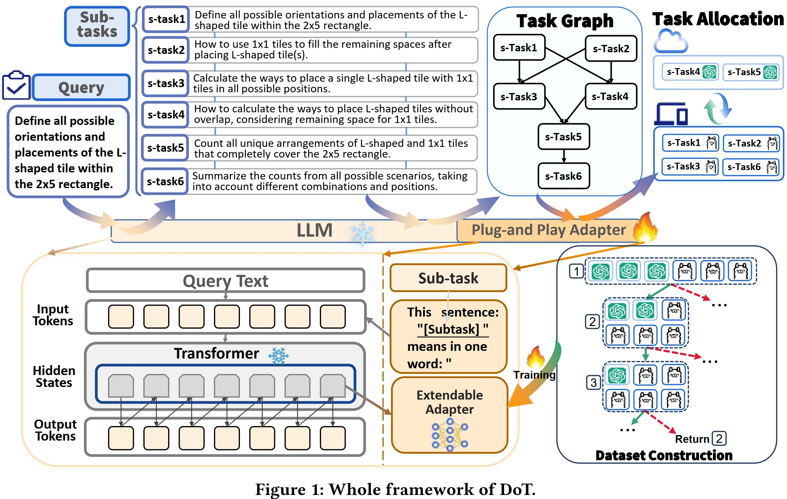

## Our submission :fire: **Division-of-Thoughts: Harnessing Hybrid Language Model Synergy for Efficient On-Device LLM Agents** for WWW'25! :rocket:





### Abstract

> With the emergence of edge AI application scenarios such as on-device web search assistants, enhancing the reasoning performance of large language models (LLMs) on edge devices has become an increasingly important topic. Due to the memory and computation limitations of edge devices, edge-cloud collaboration presents a promising solution, which involves deploying smaller LLMs locally while invoking larger-scale LLMs in the cloud. However, how to coordinate these two to balance cost and performance is a challenge. We propose a new collaborative reasoning framework called Division-of-Thoughts (DoT) to fully harness the synergy between locally deployed SLMs and cloud-based LLMs. DOT leverages a Task Decomposer to elicit the inherent planning abilities in language models to decompose user queries into smaller sub-tasks. DoT also employs a Task Scheduler to analyze the pair-wise dependency of sub-tasks and create a dependency graph, facilitating parallel reasoning of sub-tasks and the identification of key steps. To allocate the appropriate model based on the difficulty of sub-tasks, DoT leverages a Plug-and-Play Adapter, which is an additional task head attached to the SLM that does not alter the SLM's parameters. To boost the allocation of the adapter, We also design a self-reinforced tree search algorithm to create a high-qualiy sub-task allocation dataset. Extensive experiments on various benchmarks demonstrate that our DoT significantly reduces LLM costs while maintaining reasoning accuracy. Comparable to the best baseline methods, we reduce the average reasoning time and API costs by 66.12% and 83.57%, respectively. Our code can be accessed via the following link: https://anonymous.4open.science/status/DoT-F17C
>


### Experiment:

:gear:Run: Please put your openai key in function *setOpenAi*:

```
def setOpenAi(keyid = 0):
    # set your openai key here.
    if keyid == 0:
        api_key = ""
    client = OpenAI(api_key=api_key)
    addtoken(-1)
    return client
```
You can set more than one api key for usage.

